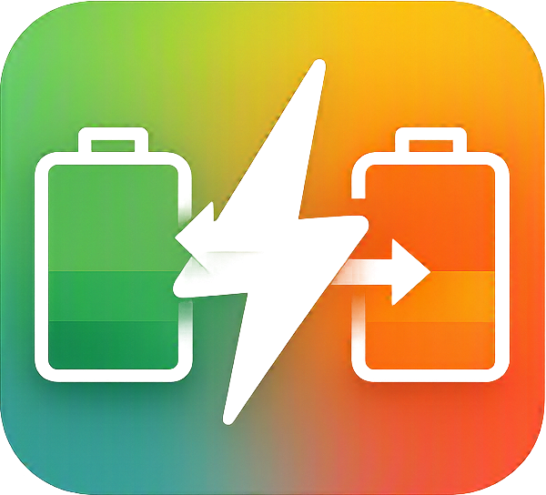

# ePlan Switch



A lightweight Windows tray application for switching between and editing configurable Windows power profiles.

> Current application version: **1.5.0**
> Supported platforms: **Windows 10 and Windows 11**

## New in version 1.5.0

* Any number of profiles instead of a fixed two-profile setup
* Add profiles using the **+** tab
* Remove profiles from their own tabs
* Enable or disable individual profiles for hotkey switching
* Cycle through all enabled profiles in tab order
* Keep disabled profiles editable and apply them manually
* Hide the warning section when no conflict or limitation is detected
* Shorter and clearer help text
* Clearly mark missing assigned Windows power plans in the profile selector
* Automatically migrate older configurations using `toggle_profiles`

## Features

* Global hotkey, default **Ctrl + F12**
* Any number of configurable profiles
* Add, rename, disable, reorder, and remove profiles
* Select any installed Windows power plan for each profile
* Processor minimum and maximum state
* Processor boost mode
* Core Parking: unchanged, custom, or fully disabled
* Energy/performance preference (EPP)
* Cooling policy
* Separate display, sleep, and hibernation timeouts for AC and battery power
* Automatic detection of processor settings exposed by Windows
* Optional support for a second processor efficiency class on hybrid CPUs
* German and English interface
* Per-user Windows autostart
* Power-plan manager for activation, removal, and restoration of standard plans
* Tray menu and fading status popup
* External `config.json`
* Automatic migration of older compatible configuration files
* Log file for unsupported settings and Windows command errors

## Managing profiles

Each profile has its own tab in the configuration window.

* **+** adds a new profile by copying the last selected profile as a starting point.
* **Remove profile** removes only the ePlan Switch profile. It does not delete the assigned Windows power plan.
* **Include in hotkey switching** controls whether the profile is included in the normal hotkey cycle.
* Disabled profiles remain editable and can still be applied manually.

At least one profile must remain, and at least one profile must be enabled for hotkey switching.

The global hotkey cycles through enabled profiles in tab order.

If the Windows power plan assigned to a profile is unavailable:

* The missing plan is visibly marked in the profile selector.
* The profile is skipped during hotkey switching.
* The event is written to `energieplan-umschalter.log`.

## CPU settings

### Processor performance range

The minimum and maximum processor states are percentages.

* The minimum value controls the lowest requested processor performance level.
* The maximum value acts as a hard upper limit.
* Processor boost may be restricted when the maximum value is below `100%`.

The processor maximum limit takes priority over EPP and processor boost settings.

### Processor boost mode

The available boost modes depend on the values exposed by Windows.

A boost mode such as **Aggressive** allows the processor to increase its clock speed more quickly when performance is required.

Boost may have little or no effect when the maximum processor state is below `100%`.

### Core Parking

Available modes:

* **Do not change:** Keep the current Windows value.
* **Custom:** Configure the minimum and maximum percentage of active processors.
* **Disable Core Parking:** Set both the minimum and maximum values to `100%`.

A minimum value of `100%` keeps all processors active.

A maximum value below `100%` limits how many processors Windows may use and can therefore reduce performance.

### Energy preference (EPP)

Energy Performance Preference controls whether Windows should favor performance or energy savings.

* `0` favors maximum performance.
* `100` favors maximum energy savings.

The processor maximum limit takes priority over EPP and processor boost settings.

### Cooling policy

The cooling policy determines how Windows reacts when the processor becomes warm.

* **Active:** Increase fan speed before reducing processor performance.
* **Passive:** Reduce processor performance before increasing fan speed.
* **Do not change:** Keep the existing Windows setting.

Available options may depend on the Windows installation and hardware.

### Hybrid CPU support

The option **Automatically apply additional hybrid CPU settings** applies settings for a second processor efficiency class only when Windows exposes the required parameters.

This is not based on a fixed Intel or AMD processor list.

If Windows does not report the additional parameters, no extra values are changed.

Unsupported optional values are skipped and written to:

```text
energieplan-umschalter.log
```

## UI warnings

The **Warnings** section is displayed only when ePlan Switch detects a conflicting or potentially limiting configuration.

Possible warnings include:

* Processor minimum above processor maximum
* Processor boost enabled while processor maximum is below `100%`
* Aggressive boost combined with a strong energy-saving preference
* Core Parking minimum above Core Parking maximum
* Core Parking maximum below `100%`, limiting available processors

When none of these conditions is detected, the warning section remains hidden.

Warnings do not normally prevent a profile from being saved or applied. They are intended to explain settings that may not behave as expected.

## Timeout values

Timeout fields use minutes.

|           Value | Meaning                                         |
| --------------: | ----------------------------------------------- |
|             `0` | Never turn off the display, sleep, or hibernate |
|  Blank / `null` | Keep the existing Windows value                 |
| Positive number | Timeout in minutes                              |

Separate values can be configured for:

* AC power
* Battery power
* Display timeout
* Sleep timeout
* Hibernation timeout

## Default profiles

All default values can be changed through the graphical editor or directly in `config.json`.

Both default profiles can be renamed, disabled, removed, or used as the basis for additional profiles.

### Summer / Browsing

Designed to reduce processor power consumption and heat during browsing, office work, media playback, and other light desktop tasks.

* Minimum processor state: **5%**
* Maximum processor state: **50%**
* Processor boost mode: **Disabled**
* Core Parking on AC power: **10–100%**
* Core Parking on battery power: **5–100%**
* EPP on AC power: **80**
* EPP on battery power: **90**
* Cooling policy: **Active**
* Display timeout: **Never**
* Sleep timeout: **Never**
* Hibernation timeout: **Never**

### Performance

Designed for gaming, rendering, compilation, and other demanding workloads.

* Minimum processor state: **5%**
* Maximum processor state: **100%**
* Processor boost mode: **Aggressive**
* Core Parking: **Disabled**
* EPP: **0**
* Cooling policy: **Active**
* Display timeout: **Never**
* Sleep timeout: **Never**
* Hibernation timeout: **Never**

## Configuration editor

The graphical configuration editor contains the following areas.

### General

* Interface language
* Windows autostart
* Global hotkey
* Startup popup
* Apply the active profile when the application starts
* Popup duration
* Popup size
* Popup position

### Profile settings

* Profile name
* Include or exclude the profile from hotkey switching
* Windows power-plan assignment
* Processor minimum state
* Processor maximum state
* Processor boost mode
* Core Parking
* Energy Performance Preference
* Cooling policy
* Display timeout
* Sleep timeout
* Hibernation timeout
* Separate values for AC and battery power

### Power plans

* Reload installed plans from Windows
* Mark the currently active plan
* Activate a selected plan
* Restore a missing Windows standard plan
* Remove an inactive and unused plan

## Power-plan management

ePlan Switch reads the installed Windows power plans using `powercfg` whenever the **Power plans** page is opened and after every plan change.

Available actions:

* Activate an installed plan
* Remove an unused plan
* Restore a missing Windows standard plan
* Reload the list of plans reported by Windows

### Supported Windows standard plans

* Power saver
* Balanced
* High performance
* Ultimate Performance

A missing standard plan can be restored individually.

ePlan Switch intentionally does not use:

```text
powercfg /restoredefaultschemes
```

That command may remove custom power plans.

### Removing a power plan

The **Remove** action uses:

```text
powercfg /delete
```

The following plans are protected and cannot be removed through ePlan Switch:

* The currently active Windows power plan
* A plan assigned to any ePlan Switch profile

Deleted custom plans cannot be restored automatically.

Back up important custom power plans before removing them.

Removing a Windows power plan is separate from removing an ePlan Switch profile. Deleting a profile does not delete its assigned Windows plan.

## Configuration format

The external `config.json` contains the user-editable application and profile settings.

The graphical editor is the recommended way to change the configuration. Manual editing can be useful for deployment, backups, troubleshooting, and advanced customization.

Version 1.5.0 uses configuration schema version `4`.

Profile order is stored in `app.profile_order`. Each profile also contains an `enabled` value.

Example:

```json
{
  "schema_version": 4,
  "app": {
    "language": "en",
    "autostart": false,
    "hotkey": {
      "key": "F12",
      "ctrl": true,
      "alt": false,
      "shift": false,
      "win": false
    },
    "profile_order": [
      "summer",
      "performance"
    ]
  },
  "profiles": {
    "summer": {
      "display_name": "Summer / Browsing",
      "enabled": true
    },
    "performance": {
      "display_name": "Performance",
      "enabled": true
    }
  }
}
```

Older compatible configurations are supplemented with newly introduced default values.

Configurations using the former `toggle_profiles` field are migrated automatically to the current profile-order and enabled-state format.

Supported interface languages:

```text
de
en
```

## Autostart

The **Start automatically with Windows** option creates an entry for the current Windows user under:

```text
HKEY_CURRENT_USER\Software\Microsoft\Windows\CurrentVersion\Run
```

Administrator rights are normally not required because the setting applies only to the current user.

## Running from Python

### Requirements

* Windows 10 or Windows 11
* Python 3
* Windows Python Launcher `py`

Install the required Python packages:

```powershell
py -3 -m pip install -r requirements.txt
```

Start the application:

```powershell
py -3 power_plan_switcher.py
```

Alternatively, run:

```text
start-python.bat
```

## Building the EXE

Optionally place one of the following files in the project directory:

```text
logo.ico
logo.png
```

Run:

```text
build.bat
```

The build script creates a local virtual environment, installs the required packages, and runs PyInstaller.

Output:

```text
dist\ePlan-Switch.exe
```

Keep at least the following files together:

```text
ePlan-Switch.exe
config.json
```

Depending on the release package, the following files may also be included:

```text
logo.ico
logo.png
README.md
README_EN.md
VERSION.txt
```

## Logs and troubleshooting

Warnings and errors are written next to the application as:

```text
energieplan-umschalter.log
```

Common checks:

1. Confirm that only one instance of ePlan Switch is running.
2. Confirm that the configured global hotkey is not already registered by another application.
3. Keep `config.json` next to the EXE.
4. Open the power-plan manager and reload the installed plans.
5. Restore or reassign a missing Windows power plan.
6. Reload the power-plan list after changing plans outside ePlan Switch.
7. Check `energieplan-umschalter.log` when a setting is unsupported or a Windows command fails.

Some Windows installations, processors, and motherboards do not expose every optional processor setting.

ePlan Switch continues applying the remaining supported values and records unsupported operations in the log.

## Project files

```text
power_plan_switcher.py   Main application
config.json              User-editable configuration
build.bat                Windows EXE build script
start-python.bat         Python development launcher
requirements.txt         Python dependencies
README.md                Main project documentation
README_EN.md             English documentation
VERSION.txt              Current application version
logo.ico / logo.png      Optional application icon
```

## Important notice

Changing Windows power settings can affect:

* System performance
* Power consumption
* Battery runtime
* Processor temperature
* Fan noise
* System responsiveness
* Display timeout
* Sleep behavior
* Hibernation behavior
* Unattended tasks

Review the selected values before applying them, especially on laptops or computers that must remain available for unattended work.
